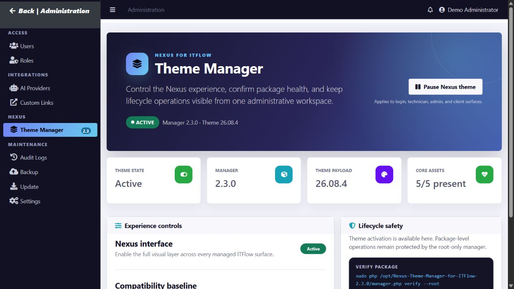

# Nexus Theme Manager for IT Flow

[](https://github.com/ithealthtech/nexus-theme-manager-for-itflow/actions/workflows/ci.yml)
[](LICENSE)
[](https://github.com/itflow-org/itflow)

Nexus Theme Manager is a lifecycle-managed ITFlow interface package with a polished, administrator-only control panel and a protected root-only installer. Administrators can activate or pause the visual theme inside ITFlow without granting the web service permission to install, replace, or remove application code.

ITFlow 26.08 does not expose a native plugin or theme-hook loader. Nexus therefore provides plugin-style lifecycle behavior around the exact supported templates: compatibility checks, immutable package checksums, out-of-web-root backups, atomic file replacement, enable/disable, conflict-safe uninstall, PHP linting, and operation locking.

## Administration manager



After installation, open **Administration → NEXUS → Theme Manager**. The page shows the active package and theme versions, exact ITFlow compatibility baseline, core asset health, protected lifecycle commands, and a CSRF-protected control for activating or pausing the Nexus visual layer across login, technician, administration, and client surfaces.

Package installation, file replacement, rollback, and uninstall remain root-only CLI operations. The administration page can change presentation state, but it cannot bypass compatibility checks or modify the protected recovery state.

## Technician theme preview


This screenshot was captured from an isolated local ITFlow 26.08/AdminLTE test environment using the release stylesheet and sanitized demonstration data.

## Compatibility

| Item | Supported value |
|---|---|
| ITFlow release | 26.08 |
| ITFlow commit | `89b080b430aaafba5d520c4e52c57b28a9559085` |
| Theme manager | 2.3.0 |
| Theme payload | 26.08.4 |
| Runtime | PHP 8.1 or newer; CLI SAPI for lifecycle operations and the normal ITFlow web SAPI for administration controls |
| Target systems | Debian/Ubuntu production installs; lifecycle tests also run on Windows |

The manager validates all 13 upstream template hashes before installation. A newer or locally modified ITFlow checkout is refused without changing files. Build a new compatibility package for that revision instead of forcing this package.

Download the versioned ZIP and checksum from the [latest release](https://github.com/ithealthtech/nexus-theme-manager-for-itflow/releases/latest). GitHub's automatically generated source archives are also available, but the versioned release ZIP is the tested installation artifact.

### Download from Debian

Install the command-line prerequisites, set `nexus_version` to the release you want, then download and verify the packaged release:

```bash
sudo apt-get update
sudo apt-get install -y ca-certificates curl unzip

nexus_version="2.3.0"
nexus_asset="Nexus-Theme-Manager-for-ITFlow-${nexus_version}"
nexus_download_dir="$HOME/Downloads/nexus-theme-manager"

mkdir -p "$nexus_download_dir"
cd "$nexus_download_dir"

curl --fail --location --remote-name \
  "https://github.com/ithealthtech/nexus-theme-manager-for-itflow/releases/download/v${nexus_version}/${nexus_asset}.zip"
curl --fail --location --remote-name \
  "https://github.com/ithealthtech/nexus-theme-manager-for-itflow/releases/download/v${nexus_version}/${nexus_asset}.zip.sha256.txt"

sha256sum --check "${nexus_asset}.zip.sha256.txt"
sudo unzip -q "${nexus_asset}.zip" -d /opt
cd "/opt/${nexus_asset}"
```

Continue only if `sha256sum` reports `OK`. The final `cd` places the shell in the verified package directory so the installation commands below can be run as written.

### Automated latest-release install

The repository also includes a root-only bootstrap script that resolves the latest GitHub release, downloads and verifies the versioned archive, extracts it to the expected directory under `/opt`, runs `doctor`, installs the theme, and verifies the result:

```bash
curl --fail --location --remote-name \
  https://raw.githubusercontent.com/ithealthtech/nexus-theme-manager-for-itflow/main/install-latest.sh
chmod +x install-latest.sh
sudo ./install-latest.sh --root /var/www/itflow.example.com
```

To store manager state somewhere other than `/var/lib/nexus-itflow-theme`, add `--state-root PATH`. The script refuses an existing versioned extraction directory and never skips checksum or compatibility validation.

### Upgrade from 2.2.0

The protected manager does not overwrite an active package in place. Verify and uninstall 2.2.0 with its original manager, then run the latest-release installer:

```bash
sudo php /opt/Nexus-Theme-Manager-for-ITFlow-2.2.0/manager.php verify --root /var/www/itflow.example.com
sudo php /opt/Nexus-Theme-Manager-for-ITFlow-2.2.0/manager.php uninstall --root /var/www/itflow.example.com --yes
sudo ./install-latest.sh --root /var/www/itflow.example.com
```

The bootstrap installer detects existing protected Nexus state before downloading anything and prints this upgrade requirement instead of attempting an unsafe overwrite.

## Package layout

- `manager.php`: lifecycle manager
- `manifest.json`: compatibility and immutable file checksums
- `payload/`: 17 managed theme, administration, and integration files
- `baseline/`: exact supported upstream templates used for compatibility and testing
- `docs/`: design, changed-file, and test documentation
- `install.sh` / `uninstall.sh`: lifecycle command wrappers for an extracted package
- `install-latest.sh`: GitHub latest-release download, verification, extraction, and install bootstrap

## Install

1. Create and verify an ITFlow application/database backup.
2. Extract this ZIP outside the ITFlow document root, for example `/opt/Nexus-Theme-Manager-for-ITFlow-2.3.0`.
3. Run the non-mutating preflight:

```bash
sudo php manager.php doctor --root /var/www/itflow.example.com
```

4. Install:

```bash
sudo php manager.php install --root /var/www/itflow.example.com --yes
```

5. Clear PHP opcode caches with the server's normal graceful reload, for example:

```bash
sudo systemctl reload apache2
```

6. Verify the manager and smoke-test login, customer, technician, and administration pages:

```bash
sudo php manager.php verify --root /var/www/itflow.example.com
sudo php manager.php status --root /var/www/itflow.example.com
```

7. Open **Administration → NEXUS → Theme Manager** and confirm that the theme is Active and all five core administration assets are present.

State and original-file backups default to `/var/lib/nexus-itflow-theme/<instance-id>`, outside the web root. Use `--state-root PATH` consistently on every command only when the default is unsuitable.

## Lifecycle commands

```bash
# Preflight only; changes nothing
sudo php manager.php doctor --root /var/www/itflow.example.com

# Install and enable
sudo php manager.php install --root /var/www/itflow.example.com --yes

# Adopt the exact theme if it was previously installed manually
sudo php manager.php adopt --root /var/www/itflow.example.com --yes

# Inspect drift/conflicts
sudo php manager.php status --root /var/www/itflow.example.com

# Verify checksums and PHP syntax
sudo php manager.php verify --root /var/www/itflow.example.com

# Temporarily restore upstream templates but retain manager state
sudo php manager.php disable --root /var/www/itflow.example.com --yes

# Reapply the theme after a disable
sudo php manager.php enable --root /var/www/itflow.example.com --yes

# Remove the theme and archive recovery state outside the web root
sudo php manager.php uninstall --root /var/www/itflow.example.com --yes

# Full removal, including recovery state
sudo php manager.php uninstall --root /var/www/itflow.example.com --yes --purge
```

Add `--json` to any command for automation-friendly output.

## Migrating from version 1.0.0

Version 2.0.0 removes the previous organization-specific naming, website links, stylesheet name, CSS namespace, package ID, and state path. Do not install it over an enabled 1.0.0 payload.

1. Use the extracted 1.0.0 manager to verify and uninstall the old payload. The normal uninstall restores the pinned upstream templates and archives its recovery state.

```bash
sudo php /opt/theme-manager-1.0.0/manager.php verify --root /var/www/itflow.example.com
sudo php /opt/theme-manager-1.0.0/manager.php uninstall --root /var/www/itflow.example.com --yes
```

2. Run the current preflight and install.

```bash
sudo php /opt/Nexus-Theme-Manager-for-ITFlow-2.3.0/manager.php doctor --root /var/www/itflow.example.com
sudo php /opt/Nexus-Theme-Manager-for-ITFlow-2.3.0/manager.php install --root /var/www/itflow.example.com --yes
```

The new protected state root is `/var/lib/nexus-itflow-theme`. Keep the archived 1.0.0 recovery state until the Nexus installation and portal smoke tests pass.

### Adopting an existing exact installation

If this same payload was installed manually before the lifecycle manager existed, run `adopt` instead of `install`. Adoption requires all 17 live files to match the package exactly, writes only protected manager state and baseline backups, and does not rewrite an ITFlow file.

```bash
sudo php manager.php adopt --root /var/www/itflow.example.com --yes
sudo php manager.php verify --root /var/www/itflow.example.com
```

## Safety behavior

- The installer refuses missing, newer, or locally modified baseline templates.
- Package payload and baseline files must match the hashes recorded in the manifest; verify the outer ZIP checksum before extraction.
- All PHP payload files pass `php -l` before activation.
- Existing owner, group, and file modes are recorded and restored.
- Original templates are copied to root-only state storage before the first write.
- Managed files are activated using same-directory temporary files and atomic rename on Linux.
- Disable or uninstall refuses to overwrite a managed file changed after installation.
- Adoption refuses anything except an exact known payload and never rewrites live ITFlow files.
- A per-instance lock prevents concurrent lifecycle operations.
- A failed install attempts automatic rollback before returning an error.
- In-app theme changes require an authenticated ITFlow administrator, a valid CSRF token, and a writable ITFlow uploads directory.
- The web control writes only a fixed presentation-state marker; it cannot install, update, uninstall, or rewrite PHP files.
- No database, schema, configuration, vendor, JavaScript, or remote asset is added.

## ITFlow updates

Do not run the ITFlow updater over an enabled theme without planning reconciliation.

1. Verify the current theme state.
2. Disable or uninstall the theme.
3. Update ITFlow and complete its migrations/tests.
4. Obtain a theme-manager release whose manifest supports the new ITFlow revision.
5. Run `doctor`, then install the compatible package.

Because ITFlow does not have native theme hooks, a theme package cannot safely claim compatibility with template revisions it has not tested.

## Recovery

If the extracted package is lost, the original files remain in the state directory. Do not hand-copy them unless normal lifecycle commands cannot run. Start with:

```bash
sudo php manager.php status --root /var/www/itflow.example.com
sudo php manager.php verify --root /var/www/itflow.example.com
```

For an immediate visual pause, use **Administration → NEXUS → Theme Manager**. To restore every original ITFlow template while retaining recovery state, use CLI `disable`. For complete removal, use `uninstall`.

## License and support

This project is GPL-3.0 licensed because it packages modified ITFlow templates. See [LICENSE](LICENSE) and [NOTICE.md](NOTICE.md). It is an independent integration and is not an official ITFlow project. Please use GitHub Issues for reproducible defects and Discussions for general questions.
