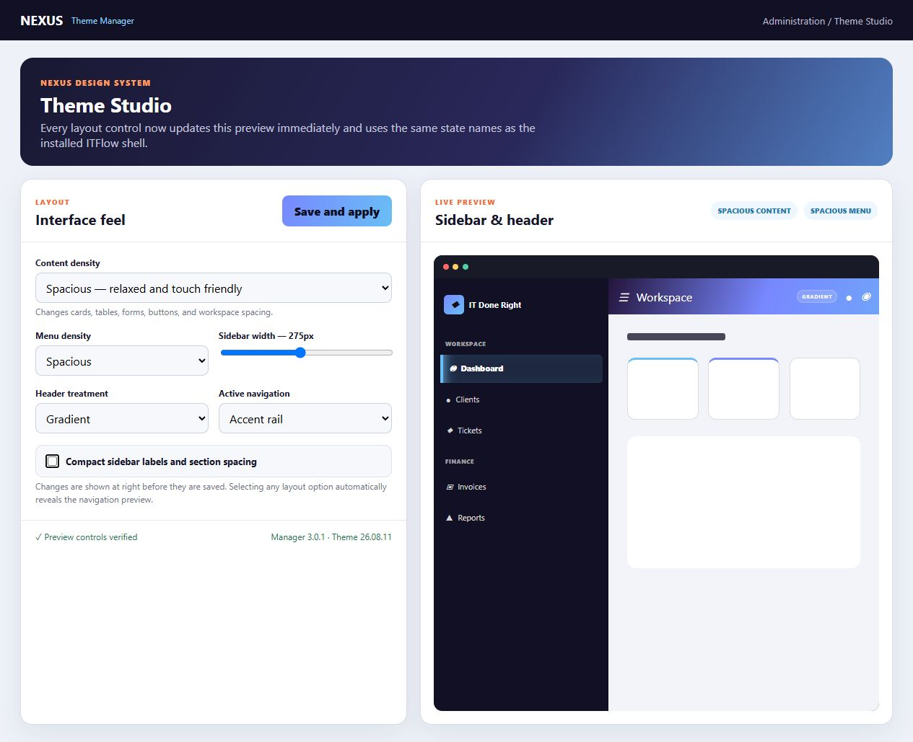
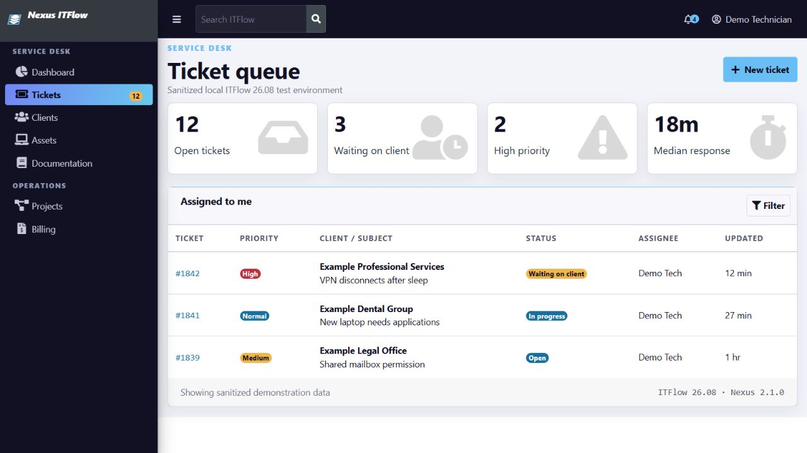

# Nexus Theme Manager for IT Flow

[](https://github.com/ithealthtech/nexus-theme-manager-for-itflow/actions/workflows/ci.yml)
[](LICENSE)
[](https://github.com/itflow-org/itflow)

Nexus Theme Manager is a lifecycle-managed ITFlow interface package with a full administrator-only Theme Studio, protected root-only installer, and verified GUI update workflow. Administrators can control responsive branding, navigation, login imagery, presets, scheduling, rollback, layout, content, motion, and colors from a live visual workspace without granting the web service permission to execute commands or directly replace application code.

ITFlow 26.08 does not expose a native plugin or theme-hook loader. Nexus therefore provides plugin-style lifecycle behavior around the exact supported templates: compatibility checks, immutable package checksums, out-of-web-root backups, atomic file replacement, enable/disable, conflict-safe uninstall, PHP linting, and operation locking.

## Administration manager



After installation, open **Administration → NEXUS → Theme Manager**. Theme Studio provides:

- Separate light and dark PNG, JPEG, WebP, or animated GIF logos with native embedded timing—including 24fps artwork—plus content inspection, an 8 MB limit, dimension limits, safe fixed filenames, automatic contrast selection, sizing, and alignment controls.
- Independent logo placement for authentication pages, the linked technician navigation header, and the client portal; visible company-name text is suppressed wherever the custom logo is active.
- Display name, tagline, browser title, custom favicon, login background with focal-point and overlay controls, login messaging, and client-portal messaging.
- Nine-part color system with independent sidebar, header, and header-text colors; five curated presets; free-form controls; instant authentication and navigation previews; and live WCAG contrast feedback.
- Sidebar width and compact mode, independent content and menu density, solid/gradient/glass headers, pill/rail/outline active navigation, corner styles, and 90–110% interface scaling.
- Subtle, fluid, or snappy motion profiles for modals, dropdowns, tooltips, popovers, alerts, toasts, and floating panels, with an instant Theme Studio preview and full reduced-motion support.
- Named saved presets with import/export, scheduled activation or pause, reversible one-click rollback, configuration import/export, reset, asset health, and theme pause/activation.
- Atomic settings writes, administrator permissions, CSRF protection, audit logging, and a CSP-compatible same-origin generated stylesheet.

Theme Studio also checks for Nexus releases and can queue an update. A root-owned systemd path service handles the privileged work with a fixed GitHub repository, exact release filenames, archive and manifest validation, SHA-256 verification, compatibility checks, and automatic rollback. The web request cannot supply a URL, command, file path, release version, or lifecycle flag.

Theme settings, rollback state, schedules, presets, and uploaded branding are stored in ITFlow's writable `uploads` area and survive CLI disable, uninstall, and version upgrades. Reset and asset-detach controls preserve the immediately previous design so rollback remains complete.

## Technician theme preview



This screenshot was captured from an isolated local ITFlow 26.08/AdminLTE test environment using the release stylesheet and sanitized demonstration data.

## Compatibility

| Item | Supported value |
|---|---|
| ITFlow release | 26.08 |
| ITFlow commit | `89b080b430aaafba5d520c4e52c57b28a9559085` |
| Theme manager | 3.0.1 |
| Theme payload | 26.08.11 |
| Runtime | PHP 8.1 or newer; CLI SAPI for lifecycle operations and the normal ITFlow web SAPI for administration controls |
| Target systems | Debian/Ubuntu production installs; lifecycle tests also run on Windows |

The manager validates all 13 upstream template hashes before installation. A newer or locally modified ITFlow checkout is refused without changing files. Build a new compatibility package for that revision instead of forcing this package.

Download the versioned ZIP and checksum from the [latest release](https://github.com/ithealthtech/nexus-theme-manager-for-itflow/releases/latest). GitHub's automatically generated source archives are also available, but the versioned release ZIP is the tested installation artifact.

### Download from Debian

Install the command-line prerequisites, set `nexus_version` to the release you want, then download and verify the packaged release:

```bash
sudo apt-get update
sudo apt-get install -y ca-certificates curl unzip

nexus_version="3.0.1"
nexus_asset="Nexus-Theme-Manager-for-ITFlow-${nexus_version}"
nexus_download_dir="$HOME/Downloads/nexus-theme-manager"

mkdir -p "$nexus_download_dir"
cd "$nexus_download_dir"

curl --fail --location --remote-name \
  "https://github.com/ithealthtech/nexus-theme-manager-for-itflow/releases/download/v${nexus_version}/${nexus_asset}.zip"
curl --fail --location --remote-name \
  "https://github.com/ithealthtech/nexus-theme-manager-for-itflow/releases/download/v${nexus_version}/${nexus_asset}.zip.sha256.txt"

sha256sum --check "${nexus_asset}.zip.sha256.txt"
sudo unzip -q "${nexus_asset}.zip" -d /opt
cd "/opt/${nexus_asset}"
```

Continue only if `sha256sum` reports `OK`. The final `cd` places the shell in the verified package directory so the installation commands below can be run as written.

### Automated latest-release install

The repository also includes a root-only bootstrap script that resolves the latest GitHub release, downloads and verifies the versioned archive, extracts it to the expected directory under `/opt`, runs `doctor`, installs and verifies the theme, and enables the protected GUI updater:

```bash
curl --fail --location --remote-name \
  https://raw.githubusercontent.com/ithealthtech/nexus-theme-manager-for-itflow/main/install-latest.sh
chmod +x install-latest.sh
sudo ./install-latest.sh --root /var/www/itflow.example.com
```

To store manager state somewhere other than `/var/lib/nexus-itflow-theme`, add `--state-root PATH`. Add `--no-gui-updater` only when you intentionally do not want the systemd updater. The script refuses an existing versioned extraction directory and never skips checksum or compatibility validation.

### Upgrade from any 2.x release

The protected manager does not overwrite an active package in place. Set `installed_version` to the active Nexus release, verify and uninstall it with its original manager, then run the latest-release installer:

```bash
installed_version="2.3.0"
sudo php "/opt/Nexus-Theme-Manager-for-ITFlow-${installed_version}/manager.php" verify --root /var/www/itflow.example.com
sudo php "/opt/Nexus-Theme-Manager-for-ITFlow-${installed_version}/manager.php" uninstall --root /var/www/itflow.example.com --yes
sudo ./install-latest.sh --root /var/www/itflow.example.com
```

The bootstrap installer detects existing protected Nexus state before downloading anything and prints this upgrade requirement instead of attempting an unsafe overwrite.

## Package layout

- `manager.php`: lifecycle manager
- `updater.php`: fixed-policy root helper and systemd service installer for GUI updates
- `manifest.json`: compatibility and immutable file checksums
- `payload/`: 18 managed theme, customization, administration, and integration files
- `baseline/`: exact supported upstream templates used for compatibility and testing
- `docs/`: design, changed-file, and test documentation
- `install.sh` / `uninstall.sh`: lifecycle command wrappers for an extracted package
- `install-latest.sh`: GitHub latest-release download, verification, extraction, and install bootstrap

## Install

1. Create and verify an ITFlow application/database backup.
2. Extract this ZIP outside the ITFlow document root, for example `/opt/Nexus-Theme-Manager-for-ITFlow-3.0.1`.
3. Run the non-mutating preflight:

```bash
sudo php manager.php doctor --root /var/www/itflow.example.com
```

4. Install:

```bash
sudo php manager.php install --root /var/www/itflow.example.com --yes
```

5. Enable protected GUI updates on a systemd Linux host:

```bash
sudo php updater.php install-service --root /var/www/itflow.example.com
```

The `install.sh` wrapper performs steps 4 and 5 automatically when it runs as root on a systemd Linux host.

6. Clear PHP opcode caches with the server's normal graceful reload, for example:

```bash
sudo systemctl reload apache2
```

7. Verify the manager and smoke-test login, customer, technician, and administration pages:

```bash
sudo php manager.php verify --root /var/www/itflow.example.com
sudo php manager.php status --root /var/www/itflow.example.com
```

8. Open **Administration → NEXUS → Theme Manager** and confirm that the theme is Active, all six core administration assets are present, and the update card reports **Ready**.

State and original-file backups default to `/var/lib/nexus-itflow-theme/<instance-id>`, outside the web root. Use `--state-root PATH` consistently on every command only when the default is unsuitable.

## Lifecycle commands

```bash
# Preflight only; changes nothing
sudo php manager.php doctor --root /var/www/itflow.example.com

# Install and enable
sudo php manager.php install --root /var/www/itflow.example.com --yes

# Adopt the exact theme if it was previously installed manually
sudo php manager.php adopt --root /var/www/itflow.example.com --yes

# Inspect drift/conflicts
sudo php manager.php status --root /var/www/itflow.example.com

# Verify checksums and PHP syntax
sudo php manager.php verify --root /var/www/itflow.example.com

# Temporarily restore upstream templates but retain manager state
sudo php manager.php disable --root /var/www/itflow.example.com --yes

# Reapply the theme after a disable
sudo php manager.php enable --root /var/www/itflow.example.com --yes

# Remove the theme and GUI updater; archive recovery state outside the web root
sudo ./uninstall.sh --root /var/www/itflow.example.com --yes

# Full removal, including recovery state
sudo ./uninstall.sh --root /var/www/itflow.example.com --yes --purge
```

Add `--json` to any command for automation-friendly output.

## GUI updates

Open **Administration → NEXUS → Theme Manager**, then use **Check for updates**. When a newer published release is available, select **Install version**. The page shows download, verification, rollback, installation, and completion state and refreshes while work is running.

If a 2.5.0–2.5.2 installation reports that the verified package could not be moved into `/opt`, repair only the protected updater service with the verified latest-release bootstrap. This does not disable or replace the active theme:

```bash
curl -fsSL https://raw.githubusercontent.com/ithealthtech/nexus-theme-manager-for-itflow/v2.5.3/install-latest.sh -o /tmp/nexus-repair.sh
sudo sh /tmp/nexus-repair.sh --root /var/www/itflow.example.com --repair-gui-updater
```

Return to Theme Studio, select **Check for updates**, then install the available release.

The browser writes only an allow-listed `check` or `update` request to ITFlow's uploads directory. A root-owned systemd path unit notices that fixed request file and launches the updater helper outside the web process. The helper always resolves the latest release from `ithealthtech/nexus-theme-manager-for-itflow`, requires an exact semantic version and asset layout, verifies the published SHA-256 file and package manifest, runs the current manager's `verify`, and runs the new manager's `doctor`, `install`, and `verify`. If activation fails, it attempts to restore and verify the previous release automatically.

Remove the system service without uninstalling the theme with:

```bash
sudo php updater.php remove-service --root /var/www/itflow.example.com
```

GUI updates require Linux, systemd, root access during one-time service setup, and `/usr/bin/curl`, `/usr/bin/unzip`, and `/usr/bin/systemctl`. If setup is absent, Theme Studio displays the exact setup command instead of presenting a non-working install action.

The updater screenshot was captured from an isolated local ITFlow/AdminLTE preview with sanitized demonstration version data; it did not contact or modify a live server.

## Migrating from version 1.0.0

Version 2.0.0 removes the previous organization-specific naming, website links, stylesheet name, CSS namespace, package ID, and state path. Do not install it over an enabled 1.0.0 payload.

1. Use the extracted 1.0.0 manager to verify and uninstall the old payload. The normal uninstall restores the pinned upstream templates and archives its recovery state.

```bash
sudo php /opt/theme-manager-1.0.0/manager.php verify --root /var/www/itflow.example.com
sudo php /opt/theme-manager-1.0.0/manager.php uninstall --root /var/www/itflow.example.com --yes
```

2. Run the current preflight and install.

```bash
sudo php /opt/Nexus-Theme-Manager-for-ITFlow-3.0.1/manager.php doctor --root /var/www/itflow.example.com
sudo php /opt/Nexus-Theme-Manager-for-ITFlow-3.0.1/manager.php install --root /var/www/itflow.example.com --yes
```

The new protected state root is `/var/lib/nexus-itflow-theme`. Keep the archived 1.0.0 recovery state until the Nexus installation and portal smoke tests pass.

### Adopting an existing exact installation

If this same payload was installed manually before the lifecycle manager existed, run `adopt` instead of `install`. Adoption requires all 18 live files to match the package exactly, writes only protected manager state and baseline backups, and does not rewrite an ITFlow file.

```bash
sudo php manager.php adopt --root /var/www/itflow.example.com --yes
sudo php manager.php verify --root /var/www/itflow.example.com
```

## Safety behavior

- The installer refuses missing, newer, or locally modified baseline templates.
- Package payload and baseline files must match the hashes recorded in the manifest; verify the outer ZIP checksum before extraction.
- All PHP payload files pass `php -l` before activation.
- Existing owner, group, and file modes are recorded and restored.
- Original templates are copied to root-only state storage before the first write.
- Managed files are activated using same-directory temporary files and atomic rename on Linux.
- Disable or uninstall refuses to overwrite a managed file changed after installation.
- Adoption refuses anything except an exact known payload and never rewrites live ITFlow files.
- A per-instance lock prevents concurrent lifecycle operations.
- A failed install attempts automatic rollback before returning an error.
- In-app theme changes require an authenticated ITFlow administrator, a valid CSRF token, and a writable ITFlow uploads directory.
- The web process can write only fixed presentation/settings files and an allow-listed update request. It cannot provide commands, URLs, paths, versions, or lifecycle flags to the root helper.
- GUI updates accept only the latest release from the fixed Nexus GitHub repository, verify its outer checksum and internal manifest, and preserve the previous package for rollback.
- No database, schema, vendor, application JavaScript, or third-party runtime asset is added. GUI setup adds only the documented per-instance systemd units, root-only updater configuration, and stable helper copy.

## ITFlow updates

Do not run the ITFlow updater over an enabled theme without planning reconciliation.

1. Verify the current theme state.
2. Disable or uninstall the theme.
3. Update ITFlow and complete its migrations/tests.
4. Obtain a theme-manager release whose manifest supports the new ITFlow revision.
5. Run `doctor`, then install the compatible package.

Because ITFlow does not have native theme hooks, a theme package cannot safely claim compatibility with template revisions it has not tested.

## Recovery

If the extracted package is lost, the original files remain in the state directory. Do not hand-copy them unless normal lifecycle commands cannot run. Start with:

```bash
sudo php manager.php status --root /var/www/itflow.example.com
sudo php manager.php verify --root /var/www/itflow.example.com
```

For an immediate visual pause, use **Administration → NEXUS → Theme Manager**. To restore every original ITFlow template while retaining recovery state, use CLI `disable`. For complete removal, use `uninstall`.

## License and support

This project is GPL-3.0 licensed because it packages modified ITFlow templates. See [LICENSE](LICENSE) and [NOTICE.md](NOTICE.md). It is an independent integration and is not an official ITFlow project. Please use GitHub Issues for reproducible defects and Discussions for general questions.
