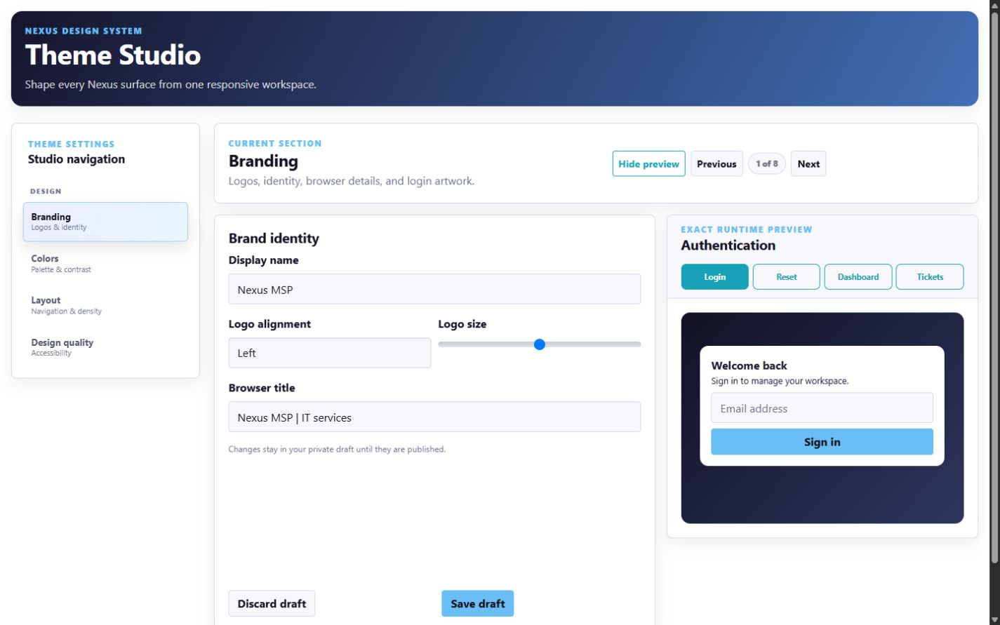

# Nexus Theme Manager for ITFlow

[](https://github.com/ithealthtech/nexus-theme-manager-for-itflow/actions/workflows/ci.yml)
[](https://github.com/ithealthtech/nexus-theme-manager-for-itflow/releases/latest)
[](LICENSE)
[](https://ithealthtech.github.io/nexus-theme-manager-for-itflow/)

Nexus gives ITFlow a polished, customizable interface without changing its database or business logic. Version 3.9 adds surface-specific design profiles, configurable navigation, automatic dark mode, an advanced asset workflow, recovery controls, side-by-side responsive previews, an observable protected updater, and a verified command-line upgrade path.



## What you can customize

- Light and dark logos, animated GIF logos, favicon, browser title, and login background
- Brand name, tagline, login copy, and client portal messaging
- Colors, typography scale, spacing, sidebar width, menu density, and compact mode
- Header treatments, active-navigation styles, corners, and interface motion
- Login, password reset, technician, client portal, guest invoice, print, and PDF surfaces
- Saved presets, scheduled activation, import/export, and protected revisions
- Independent technician, client, authentication, guest, and print profiles with global fallbacks
- Desktop and mobile navigation order, labels, approved icons, visibility, and administrator/technician access
- System, scheduled, forced, or user-selectable dark mode with an independent dark palette and logo

Theme Studio also includes:

- Eight previews built from the same presentation model, CSS variables, and shared live components
- Side-by-side desktop and 390px phone comparison for every preview surface
- Phone, tablet, laptop, widescreen, and custom-width responsive testing
- Accessibility and layout checks with direct links to affected settings
- Safe automatic corrections that remain unpublished until you approve them
- Asset crop/resize controls, image dimensions, size warnings, favicon preview, 24fps GIF inspection, and automatic WebP companions
- One-click emergency disable, known-good recovery, managed-file/CSS health checks, automatic snapshots, and sanitized diagnostics
- Live updater stages, failure details, retry, post-update health checks, checksum verification, and visible rollback status

After installation, open **Administration → NEXUS → Theme Manager**.

New to Theme Studio? Read the **[complete beginner guide](docs/theme-manager-guide.md)** for a field-by-field explanation of every option, safe draft/publish workflows, previews, updates, recovery, and troubleshooting.

For a guided installation path, interactive command builder, end-user playbooks, searchable troubleshooting, and a safe fictional interface demo, open the **[Nexus documentation portal](https://ithealthtech.github.io/nexus-theme-manager-for-itflow/)**.

## Compatibility

| Component | Supported version |
|---|---|
| Nexus manager | 3.9.1 |
| Nexus theme | 26.08.24 |
| ITFlow | 26.08 |
| ITFlow commit | `89b080b430aaafba5d520c4e52c57b28a9559085` |
| PHP | 8.1 or newer |
| Production host | Debian or Ubuntu with systemd |

Nexus checks the supported ITFlow templates before changing anything. A modified or unsupported ITFlow installation is refused without altering files.

## Install

Back up the ITFlow application and database first. Then run this as root, replacing the example path with your ITFlow document root:

```bash
curl --fail --location --remote-name \
  https://raw.githubusercontent.com/ithealthtech/nexus-theme-manager-for-itflow/main/install-latest.sh

chmod +x install-latest.sh
sudo ./install-latest.sh --root /var/www/itflow.example.com
```

The installer downloads the latest release, verifies its checksum, extracts it under `/opt`, checks ITFlow compatibility, installs the theme, verifies the result, and configures GUI updates.

Open Theme Studio after installation and confirm that the theme is active and the updater reports **Ready**.

### Manual install

Use the versioned ZIP and checksum file from the [latest release](https://github.com/ithealthtech/nexus-theme-manager-for-itflow/releases/latest). Do not use GitHub's automatically generated source archive as the installation package.

```bash
sha256sum --check Nexus-Theme-Manager-for-ITFlow-3.9.1.zip.sha256.txt
sudo unzip Nexus-Theme-Manager-for-ITFlow-3.9.1.zip -d /opt
cd /opt/Nexus-Theme-Manager-for-ITFlow-3.9.1

sudo php manager.php doctor --root /var/www/itflow.example.com
sudo php manager.php install --root /var/www/itflow.example.com --yes
sudo php updater.php install-service --root /var/www/itflow.example.com
sudo php manager.php verify --root /var/www/itflow.example.com
```

## Update

### Update from the command line

Run the following from SSH. Replace `/var/www/itflow.example.com` with the real ITFlow document root. Pass `--root` and the path as two separate arguments.

```bash
cd /tmp
curl --fail --location --output install-latest.sh \
  https://raw.githubusercontent.com/ithealthtech/nexus-theme-manager-for-itflow/main/install-latest.sh
chmod +x install-latest.sh
sudo ./install-latest.sh --root /var/www/itflow.example.com
```

That command resolves GitHub's latest published Nexus release, downloads its versioned ZIP and checksum, verifies the archive, and then:

- installs Nexus when no managed installation exists;
- verifies and upgrades an existing managed installation when a newer release exists;
- preserves whether the theme was enabled or disabled;
- verifies the replacement after installation;
- restores and verifies the previous package automatically when replacement activation fails; and
- reports that no update is required when the installed version already matches the latest release.

If the existing installation uses a custom state directory, pass the same directory used during installation:

```bash
sudo ./install-latest.sh \
  --root /var/www/itflow.example.com \
  --state-root /your/existing/nexus-state-directory
```

The installer refuses a downgrade, an invalid release tag, a mismatched state/package version, a missing current package, a failed checksum, or an incompatible ITFlow baseline before claiming success.

### Update from Theme Studio

Open **Theme Studio → Updates & System**, select **Check for updates**, then install the available release.

The web application only queues an allow-listed request. A root-owned systemd service downloads the fixed GitHub release, reports each stage, verifies the checksum and manifest, checks compatibility, installs it, runs post-update health checks, and restores the previous release if activation fails. A failed operation shows bounded details and a Retry action for the same approved operation.

The command-line updater requires the current package directory recorded by the protected updater service or the standard `/opt/Nexus-Theme-Manager-for-ITFlow-X.Y.Z` directory created by `install-latest.sh`.

## Pause or remove Nexus

The Theme Studio **Pause theme** button removes all Nexus presentation customizations immediately while keeping settings available for reactivation. **Updates & System → Recovery mode** also provides an emergency disable, a managed-file/CSS health check, and restoration of the newest pinned known-good revision.

To restore the original ITFlow templates from the command line:

```bash
sudo php manager.php disable --root /var/www/itflow.example.com --yes
```

To re-enable them:

```bash
sudo php manager.php enable --root /var/www/itflow.example.com --yes
```

To uninstall Nexus while retaining an archived recovery copy:

```bash
sudo ./uninstall.sh --root /var/www/itflow.example.com --yes
```

Nexus refuses to overwrite a managed file that changed after installation.

## Important ITFlow update rule

Disable or uninstall Nexus before updating ITFlow. Install a Nexus release only when its compatibility table explicitly supports the new ITFlow revision.

ITFlow currently has no native theme or plugin hook system, so Nexus manages a bounded set of verified templates. It never claims compatibility with templates it has not tested.

## Documentation

- [Theme Manager beginner guide](docs/theme-manager-guide.md)
- [v3.9.1 release notes](docs/release-v3.9.1.md)
- [v3.9.0 release notes](docs/release-v3.9.0.md)
- [Architecture and privilege boundaries](docs/architecture.md)
- [Managed file list](docs/changed-files.md)
- [Validation report](docs/test-report.md)
- [Lifecycle test report](docs/lifecycle-test-report.md)
- [Security policy](SECURITY.md)

## License

Nexus is an independent ITFlow integration licensed under GPL-3.0. See [LICENSE](LICENSE) and [NOTICE.md](NOTICE.md). Use GitHub Issues for reproducible defects.
